# Лабораторная работа №5. Запуск сайта в контейнере

## Студент
**Gachayev Dmitrii I2302**  
**Выполнено 16.03.2025**  

## Цель работы
Подготовка образ контейнера для запуска веб-сайта на базе Apache HTTP Server + PHP (mod_php) + MariaDB.
## Задание
Создать Dockerfile для сборки образа контейнера, который будет содержать веб-сайт на базе Apache HTTP Server + PHP (mod_php) + MariaDB. База данных MariaDB должна храниться в монтируемом томе. Сервер должен быть доступен по порту 8000. Установить сайт WordPress. Проверить работоспособность сайта.
# Выполнение

## Извлечение конфигурационных файлов apache2, php, mariadb из контейнера
1. Создаю репозиторий `containers05` и клонирую его себе на компьютер.

2. Создаю в папке `containers05` папку `files`, а также:

- `files/apache2` - для файлов конфигурации apache2;
- `files/php` - для файлов конфигурации php;
- `files/mariadb` - для файлов конфигурации mariadb.


3. Создаю в папке `containers05` файл `Dockerfile` с содержимым:

```bash
# create from debian image
FROM debian:latest

# install apache2, php, mod_php for apache2, php-mysql and mariadb
RUN apt-get update && \
    apt-get install -y apache2 php libapache2-mod-php php-mysql mariadb-server && \
    apt-get clean
```


4. Создаю образ контейнера с именем `apache2-php-mariadb`

Открываю терминал в папке `containers05` и ввожу команду для создания образа:

```bash
docker build -t apache2-php-mariadb .
```


5. Создаю контейнер `apache2-php-mariadb` из образа `apache2-php-mariadb` и запусткаю его в фоновом режиме с командой запуска bash.

```bash
docker run -d --name apache2-php-mariadb apache2-php-mariadb bash
```

- `-d` - флаг для запуска в фоновом режиме


6. Копирую из контейнера файлы конфигурации apache2, php, mariadb в папку files/ на компьютере. Выполняю команды:

```bash
docker cp apache2-php-mariadb:/etc/apache2/sites-available/000-default.conf files/apache2/
docker cp apache2-php-mariadb:/etc/apache2/apache2.conf files/apache2/
docker cp apache2-php-mariadb:/etc/php/8.2/apache2/php.ini files/php/
docker cp apache2-php-mariadb:/etc/mysql/mariadb.conf.d/50-server.cnf files/mariadb/
```


После выполнения команд в папке проекта появились файлы конфигурации.

7. Останавливаю и удаляю контейнер `apache2-php-mariadb` командами:

```bash
docker stop apache2-php-mariadb
docker rm apache2-php-mariadb
```


## Настройка конфигурационных файлов

1. Конфигурационный файл `apache2`:

Открываю файл `files/apache2/000-default.conf`, нахожу строку `#ServerName www.example.com` и заменяю её на `ServerName localhost`. Также в строке `ServerAdmin webmaster@localhost` добавляю свою почту и после строки `DocumentRoot /var/www/html` добавляю следующие строки:

```bash
DirectoryIndex index.php index.html
```


2. Конфигурационный файл `php`:

Открываю файл `files/php/php.ini`, нахожу строку `;error_log = php_errors.log` и заменяю её на `error_log = /var/log/php_errors.log`. 


Также настраиваю параметры `memory_limit`, `upload_max_filesize`, `post_max_size` и `max_execution_time` следующим образом:

- memory_limit = 128M
- upload_max_filesize = 128M
- post_max_size = 128M
- max_execution_time = 120

2. Конфигурационный файл `mariadb`:

Открываю файл `files/mariadb/50-server.cnf`, нахожу строку `#log_error = /var/log/mysql/error.log` и раскомментирую её.

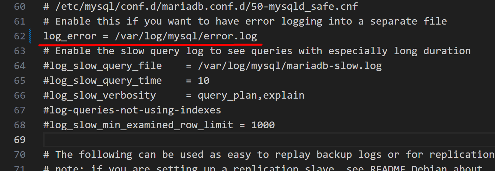

## Создание скрипта запуска

1. Создаю в папке `files` папку `supervisor` и файл `supervisord.conf` со следующим содержимым:

```bash
[supervisord]
nodaemon=true
logfile=/dev/null
user=root

# apache2
[program:apache2]
command=/usr/sbin/apache2ctl -D FOREGROUND
autostart=true
autorestart=true
startretries=3
stderr_logfile=/proc/self/fd/2
user=root

# mariadb
[program:mariadb]
command=/usr/sbin/mariadbd --user=mysql
autostart=true
autorestart=true
startretries=3
stderr_logfile=/proc/self/fd/2
user=mysql
```

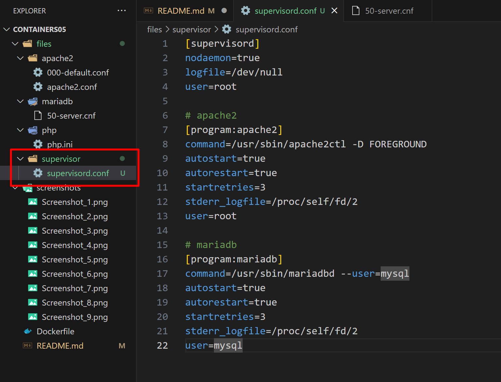

## Создание Dockerfile

1. Открываю файл `Dockerfile` и добавляю в него следующие строки:
После инструкции `FROM` ... добавляю монтирование томов:

```dockerfile
# mount volume for mysql data
VOLUME /var/lib/mysql

# mount volume for logs
VOLUME /var/log
```

В инструкции `RUN` ... добавляю установку пакета `supervisor`.

```dockerfile
apt-get install -y apache2 php libapache2-mod-php php-mysql mariadb-server supervisor && \
```

После инструкции `RUN` ... добавляю копирование и распаковку сайта WordPress:
```dockerfile
# add wordpress files to /var/www/html
ADD https://wordpress.org/latest.tar.gz /var/www/html/
```

После копирования файлов `WordPress` добавляю копирование конфигурационных файлов `apache2`, `php`, `mariadb`, а также скрипта запуска:

```dockerfile
# copy the configuration file for apache2 from files/ directory
COPY files/apache2/000-default.conf /etc/apache2/sites-available/000-default.conf
COPY files/apache2/apache2.conf /etc/apache2/apache2.conf

# copy the configuration file for php from files/ directory
COPY files/php/php.ini /etc/php/8.2/apache2/php.ini

# copy the configuration file for mysql from files/ directory
COPY files/mariadb/50-server.cnf /etc/mysql/mariadb.conf.d/50-server.cnf

# copy the supervisor configuration file
COPY files/supervisor/supervisord.conf /etc/supervisor/supervisord.conf
```

Для функционирования `mariadb` создаю папку `/var/run/mysqld` и устанавливаю права на неё:

```dockerfile
RUN mkdir /var/run/mysqld && chown mysql:mysql /var/run/mysqld
```

Открываю порт 80, добавляю команду запуска `supervisord`:

```dockerfile
EXPOSE 80
# start supervisor
CMD ["/usr/bin/supervisord", "-n", "-c", "/etc/supervisor/supervisord.conf"]
```

После всех манипуляций `Dockerfile` выглядит так:

```dockerfile
# create from debian image
FROM debian:latest
# mount volume for mysql data
VOLUME /var/lib/mysql

# mount volume for logs
VOLUME /var/log

# install apache2, php, mod_php for apache2, php-mysql and mariadb
RUN apt-get update && \
    apt-get install -y apache2 php libapache2-mod-php php-mysql mariadb-server supervisor && \
    apt-get clean

RUN mkdir /var/run/mysqld && chown mysql:mysql /var/run/mysqld

# add wordpress files to /var/www/html
ADD https://wordpress.org/latest.tar.gz /var/www/html/

# copy the configuration file for apache2 from files/ directory
COPY files/apache2/000-default.conf /etc/apache2/sites-available/000-default.conf
COPY files/apache2/apache2.conf /etc/apache2/apache2.conf

# copy the configuration file for php from files/ directory
COPY files/php/php.ini /etc/php/8.2/apache2/php.ini

# copy the configuration file for mysql from files/ directory
COPY files/mariadb/50-server.cnf /etc/mysql/mariadb.conf.d/50-server.cnf

# copy the supervisor configuration file
COPY files/supervisor/supervisord.conf /etc/supervisor/supervisord.conf

# start supervisor
CMD ["/usr/bin/supervisord", "-n", "-c", "/etc/supervisor/supervisord.conf"]

EXPOSE 80
```

Проверяю наличие сайта WordPress в папке `/var/www/html/`, вижу установленный файл:

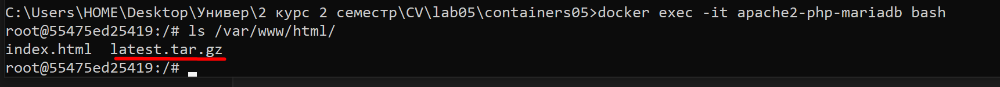

Проверяю изменения конфигурационного файла `apache2` c помощью:

```bash
docker exec -it apache2-php-mariadb bash
cat /etc/apache2/sites-available/000-default.conf
```

Вижу что файл изменился:

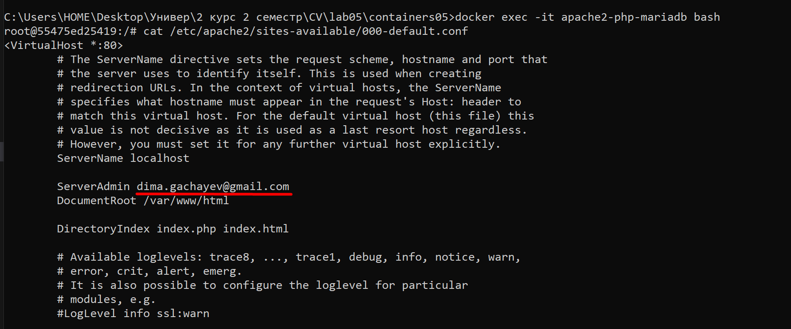

## Создание базы данных и пользователя
Создаю базу данных `wordpress` и пользователя `wordpress` с паролем `wordpress` в контейнере `apache2-php-mariadb`. Для этого, в контейнере `apache2-php-mariadb`, выполняю команды:

```bash
docker exec -it apache2-php-mariadb bash
mysql
```

```sql
CREATE DATABASE wordpress;
CREATE USER 'wordpress'@'localhost' IDENTIFIED BY 'wordpress';
GRANT ALL PRIVILEGES ON wordpress.* TO 'wordpress'@'localhost';
FLUSH PRIVILEGES;
EXIT;
```

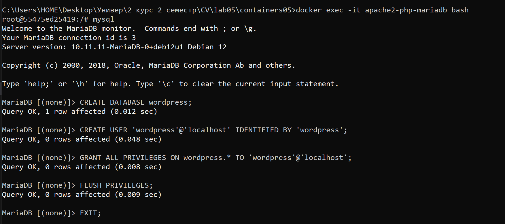

## Создание файла конфигурации WordPress

Открываю в браузере `localhost` и вижу что сайт не работает. Скорее всего проблема в том, что архив Wordpress был скачан, но не был распакован. Пробую распаковать выполняя команды:

```bash
docker exec -it apache2-php-mariadb bash
cd /var/www/html
tar -xzf latest.tar.gz --strip-components=1
```

Теперь архив распакован:

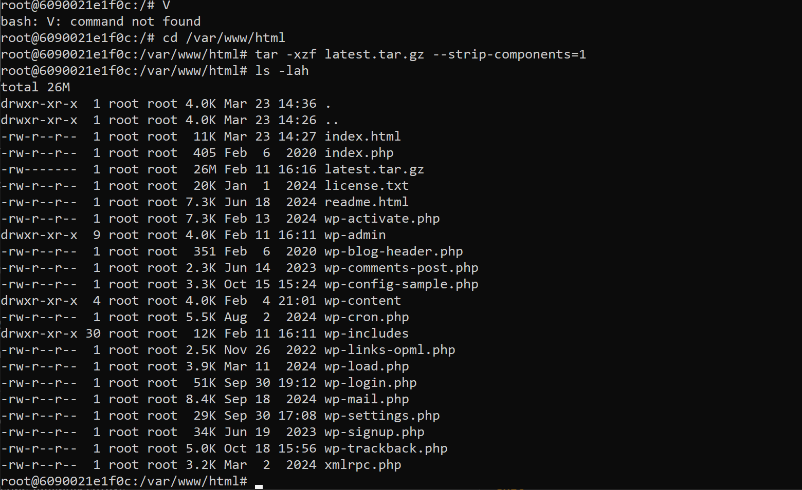

Перезапускаю контейнер и проверяю снова:

```bash
docker restart apache2-php-mariadb
```

Теперь работает, вижу страницу `wordpress`:

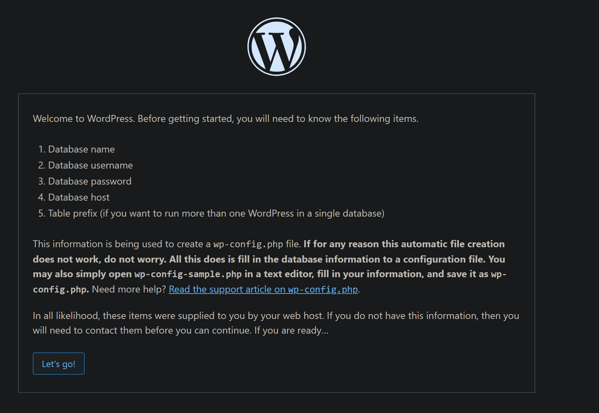

Указываю параметры подключения к бд:

- имя базы данных: `wordpress`;
- имя пользователя: `wordpress`;
- пароль: `wordpress`;
- адрес сервера базы данных: `localhost`;
- префикс таблиц: `wp_`.

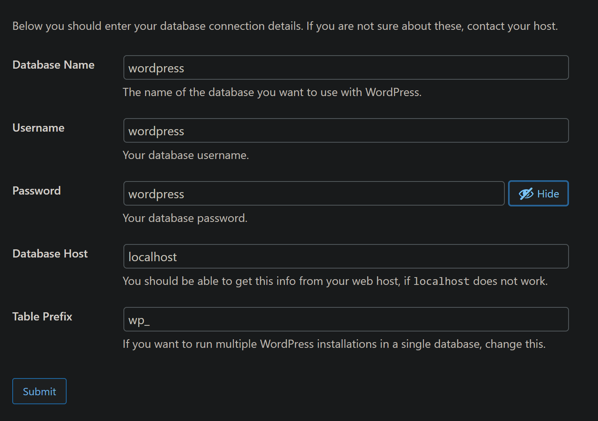

Копирую файл конфигурации в `files/wp-config.php` на компьютере.

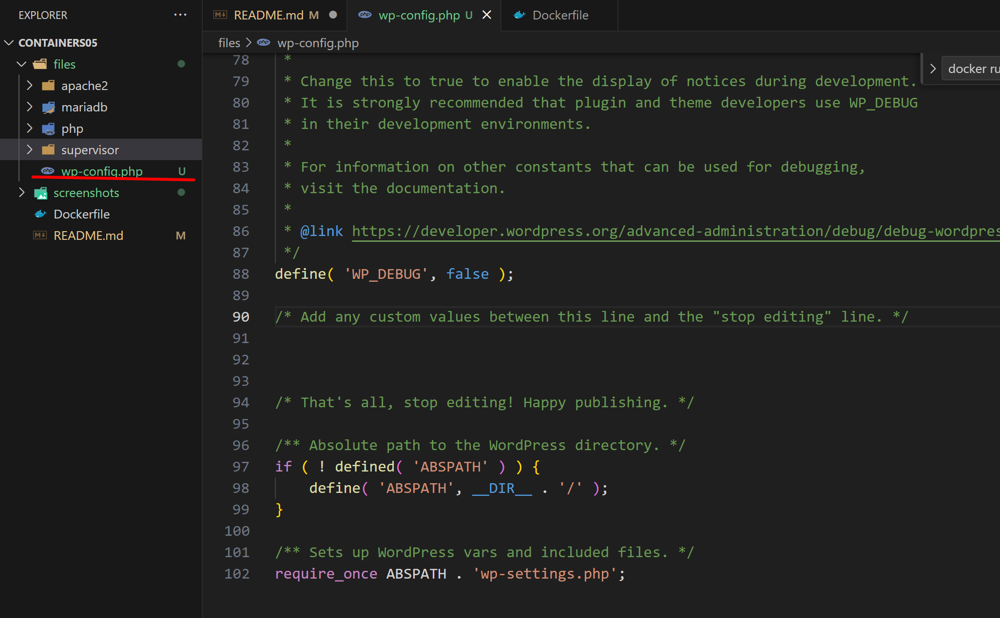

Также добавляю следующую строку в `Dockerfile`:
```dockerfile
# copy the configuration file for wordpress from files/ directory
COPY files/wp-config.php /var/www/html/wp-config.php
```

## Запуск и тестирование

Пересобираю образ контейнера с именем `apache2-php-mariadb` и запускаю контейнер `apache2-php-mariadb` из образа `apache2-php-mariadb`. Проверяю работоспособность сайта `WordPress`.

```bash
docker stop apache2-php-mariadb
docker rm apache2-php-mariadb
docker build -t apache2-php-mariadb .
docker run -d -p 80:80 --name apache2-php-mariadb apache2-php-mariadb
```

На сайте `wordpress` вижу ошибку связи с бд:

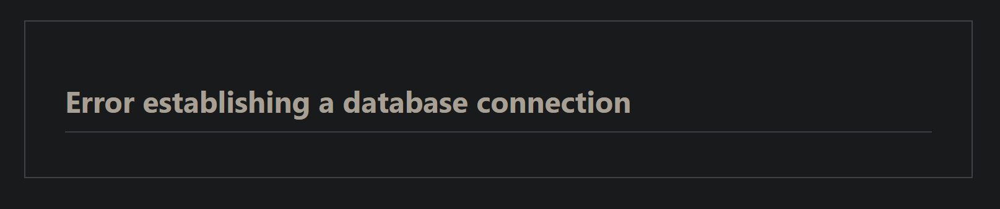

Еще раз настраиваю бд в контейнере:

```sql
CREATE DATABASE wordpress;
CREATE USER 'wordpress'@'localhost' IDENTIFIED BY 'wordpress';
GRANT ALL PRIVILEGES ON wordpress.* TO 'wordpress'@'localhost';
FLUSH PRIVILEGES;
EXIT;
```

Проблема исправлена:

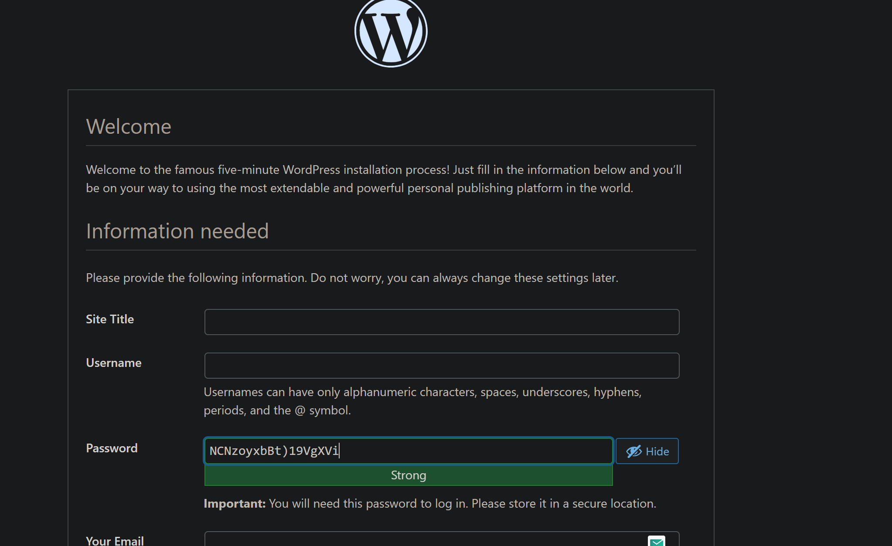

Сайт работает.

## Контрольные вопросы

1. Какие файлы конфигурации были изменены?

Были изменены следующие файлы:
- `000-default.conf` и `apache2.conf` - Apache2
- `php.ini` - php 
- `50-server.cnf` - MariaDB  
- `wp-config.php` - WordPress

2. За что отвечает инструкция `DirectoryIndex` в файле конфигурации `apache2`?

Инструкция `DirectoryIndex` в файле конфигурации `Apache2` указывает, какой файл будет загружаться по умолчанию, когда клиент обращается к каталогу на сервере. Например, если в каталоге есть файлы `index.html` и `index.php`, `Apache` загрузит тот, который указан в `DirectoryIndex`.

3. Зачем нужен файл `wp-config.php`?

`wp-config.php` в `WordPress` содержит важные настройки для подключения к базе данных и настройки конфигурации сайта. Он отвечает за подключение к бд, настройки безопасности, определение префикса таблиц и тд.

4. За что отвечает параметр `post_max_size` в файле конфигурации `php`?

`post_max_size` в файле конфигурации `php` определяет максимальный размер данных, которые могут быть отправлены через `HTTP-запрос` методом `POST`.

5. Укажите, на ваш взгляд, какие недостатки есть в созданном образе контейнера?

На мой взгляд, в образе контейнера проблематично то, что нет проверки на ошибки при запуске, нет четкого управления конфигурацией `MariaDB` и нет автоматического создания базы данных (если удалить контейнер, придется в новом снова создавать бд вручную).

## Вывод

В ходе работы была проведена настройка Docker-образа, содержащего стек для работы с веб-приложением `WordPress`, используя `Apache`, `PHP`, `MariaDB` и `Supervisor`. Основными задачами, которые были выполнены, являлись:
- Создание и настройка `Dockerfile`
- Использование `Supervisor` для управления процессами:
- Решение проблем (неверные директории)
- и так далее.
