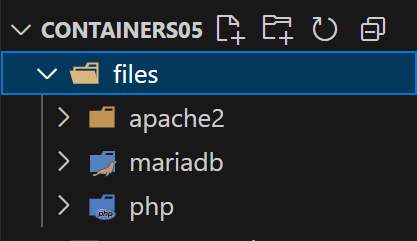
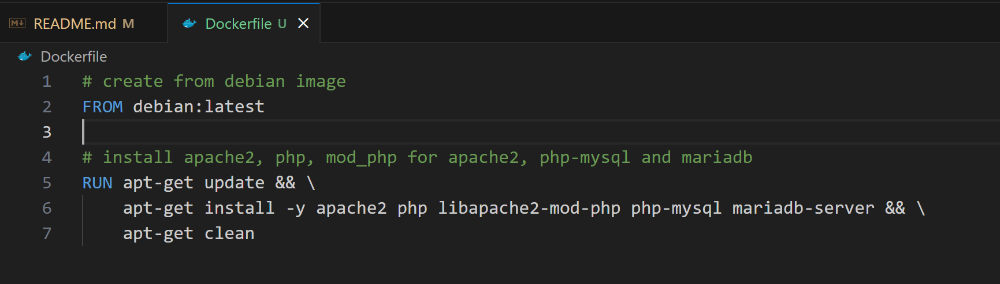
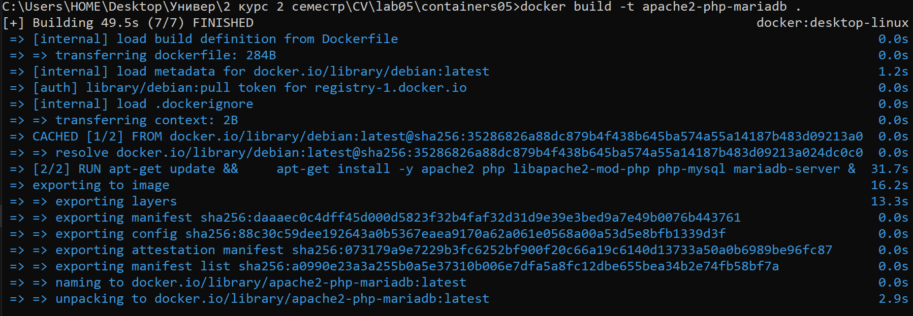
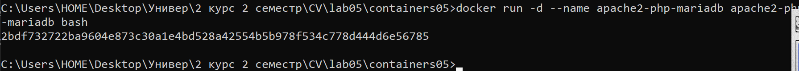
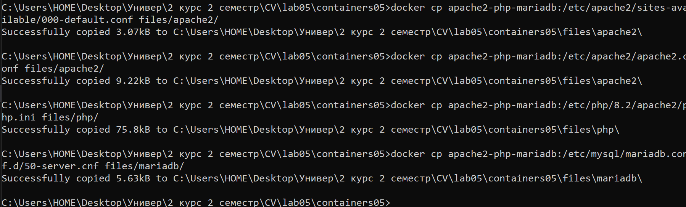
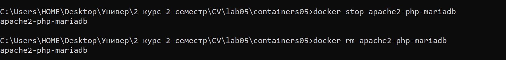
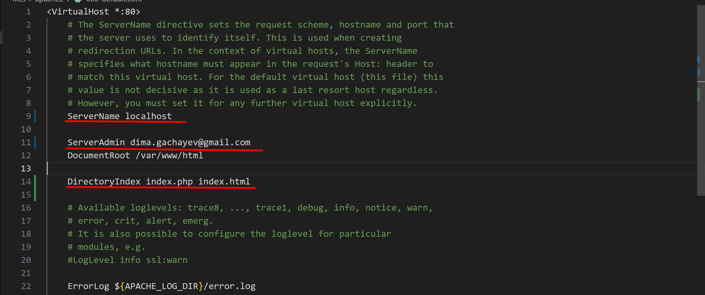
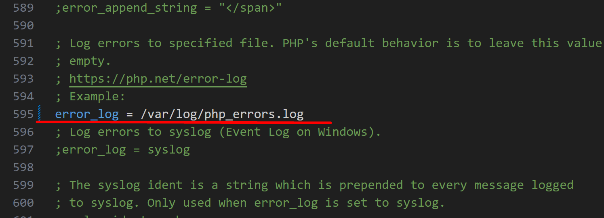

# Лабораторная работа №5. Запуск сайта в контейнере

## Студент
**Gachayev Dmitrii I2302**  
**Выполнено 16.03.2025**  

## Цель работы
Выполнив данную работу студент сможет подготовить образ контейнера для запуска веб-сайта на базе Apache HTTP Server + PHP (mod_php) + MariaDB.
## Задача
Создать Dockerfile для сборки образа контейнера, который будет содержать веб-сайт на базе Apache HTTP Server + PHP (mod_php) + MariaDB. База данных MariaDB должна храниться в монтируемом томе. Сервер должен быть доступен по порту 8000. Установить сайт WordPress. Проверить работоспособность сайта.
# Выполнение

## Извлечение конфигурационных файлов apache2, php, mariadb из контейнера
1. Создаю репозиторий `containers05` и клонирую его себе на компьютер.

2. Создаю в папке `containers05` папку `files`, а также:

- `files/apache2` - для файлов конфигурации apache2;
- `files/php` - для файлов конфигурации php;
- `files/mariadb` - для файлов конфигурации mariadb.



3. Создаю в папке `containers05` файл `Dockerfile` с содержимым:

```bash
# create from debian image
FROM debian:latest

# install apache2, php, mod_php for apache2, php-mysql and mariadb
RUN apt-get update && \
    apt-get install -y apache2 php libapache2-mod-php php-mysql mariadb-server && \
    apt-get clean
```



4. Создаю образ контейнера с именем `apache2-php-mariadb`

Открываю терминал в папке `containers05` и ввожу команду для создания образа:

```bash
docker build -t apache2-php-mariadb .
```



5. Создаю контейнер `apache2-php-mariadb` из образа `apache2-php-mariadb` и запусткаю его в фоновом режиме с командой запуска bash.

```bash
docker run -d --name apache2-php-mariadb apache2-php-mariadb bash
```

- `-d` - флаг для запуска в фоновом режиме



6. Копирую из контейнера файлы конфигурации apache2, php, mariadb в папку files/ на компьютере. Выполняю команды:

```bash
docker cp apache2-php-mariadb:/etc/apache2/sites-available/000-default.conf files/apache2/
docker cp apache2-php-mariadb:/etc/apache2/apache2.conf files/apache2/
docker cp apache2-php-mariadb:/etc/php/8.2/apache2/php.ini files/php/
docker cp apache2-php-mariadb:/etc/mysql/mariadb.conf.d/50-server.cnf files/mariadb/
```



После выполнения команд в папке проекта появились файлы конфигурации.

7. Останавливаю и удаляю контейнер `apache2-php-mariadb` командами:

```bash
docker stop apache2-php-mariadb
docker rm apache2-php-mariadb
```




## Настройка конфигурационных файлов

1. Конфигурационный файл `apache2`:

Открываю файл `files/apache2/000-default.conf`, нахожу строку `#ServerName www.example.com` и заменяю её на `ServerName localhost`. Также в строке `ServerAdmin webmaster@localhost` добавляю свою почту и после строки `DocumentRoot /var/www/html` добавляю следующие строки:

```bash
DirectoryIndex index.php index.html
```



2. Конфигурационный файл `php`:

Открываю файл `files/php/php.ini`, нахожу строку `;error_log = php_errors.log` и заменяю её на `error_log = /var/log/php_errors.log`. 



Также настраиваю параметры `memory_limit`, `upload_max_filesize`, `post_max_size` и `max_execution_time` следующим образом:

- memory_limit = 128M
- upload_max_filesize = 128M
- post_max_size = 128M
- max_execution_time = 120